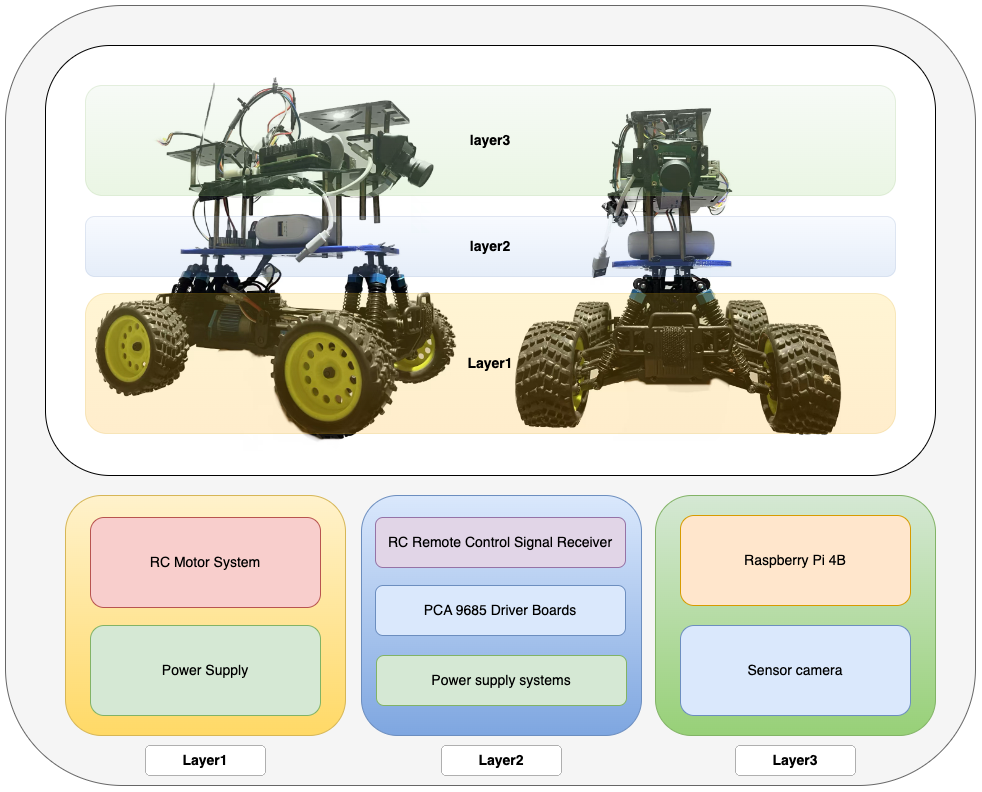

# Enhanced Autonomous Driving: PrediNet20 with AHLR

### Author:Chuanji Xu and [Jian Qu](https://scholar.google.com.hk/citations?user=LWfPeywAAAAJ&hl=zh-CN&oi=sra)
### Email: chuanji_xu@163.com

 
 
 
 
 
  
 
 

   

## Abstract

This repository hosts the implementation of the research study "Enhanced Autonomous Driving: PrediNet20 with Adaptive Huber Loss with Regularization for Improved Performance." The research introduces PrediNet20, a state-of-the-art Convolutional Neural Network (CNN), tailored for autonomous driving using the Donkeycar platform.

## PrediNet20 Model Definition

PrediNet20 is a specialized CNN developed to address the challenges of predicting throttle and steering angles in autonomous driving. The architecture consists of:

- **Convolutional Layers**: Designed to capture spatial hierarchies and patterns in the input images.
- **Fully Connected Layers**: Tailored to combine the features and make final predictions.
- **Activation Functions**: Utilizes activation functions such as ReLU for introducing non-linearities.

## Adaptive Huber Loss with Regularization (AHLR)

The AHLR is a novel loss function, a key contribution of this research. It is defined as follows:

- **Adaptive Nature**: Dynamically adjusts the loss based on the prediction error magnitude, transitioning from quadratic to linear loss.
- **Huber Component**: Controls the transition between quadratic and linear loss, minimizing the impact of outliers.
- **L1 Regularization**: Included to encourage sparsity in the model weights, aiding in reducing overfitting.

The combination of these elements leads to improved training convergence and model generalization.

## Experimental Setup

 

To test the superiority of our proposed PrediNet20 model and Adaptive Huber Loss with Regularization (AHLR) loss function, we built an experimental platform based on the small open-source autonomous driving platform Donkeycar, thus simulating the kinematics of a real car to the greatest extent possible. We also built an 18-square-meter driveway field for this purpose, so as to facilitate the driving of 1/16th of the simulated car.

## Contents

- `src/`: Source code, including model architecture, loss function.
- `models/`: trained models and weights. eg.PrediNet20AHLR64, the PrediNet20 is modle name, the AHLR is loss function, the 64 is batch size.
- `results/`: Graphs, charts, and analyses of the experimental results.
- `dataset`:https://doi.org/10.5281/zenodo.8248534
  
## Result
Through extensive experiments on real driving data, we fully validate the superior performance and faster convergence of PrediNet20 relative to existing models. The experimental results show that PrediNet20 has higher accuracy and reliability in predicting throttle and steering angles, providing an efficient and reliable solution for end-to-end autonomous driving tasks.

  
 
## License

This project is licensed under the MIT License. See the [LICENSE.md](LICENSE.md) file for details.
